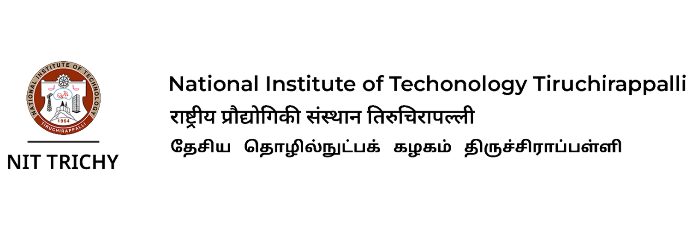
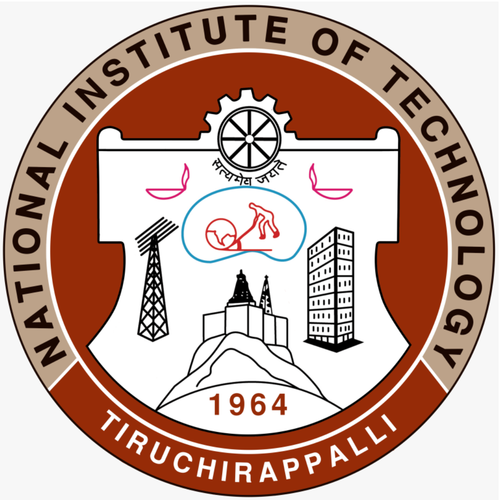
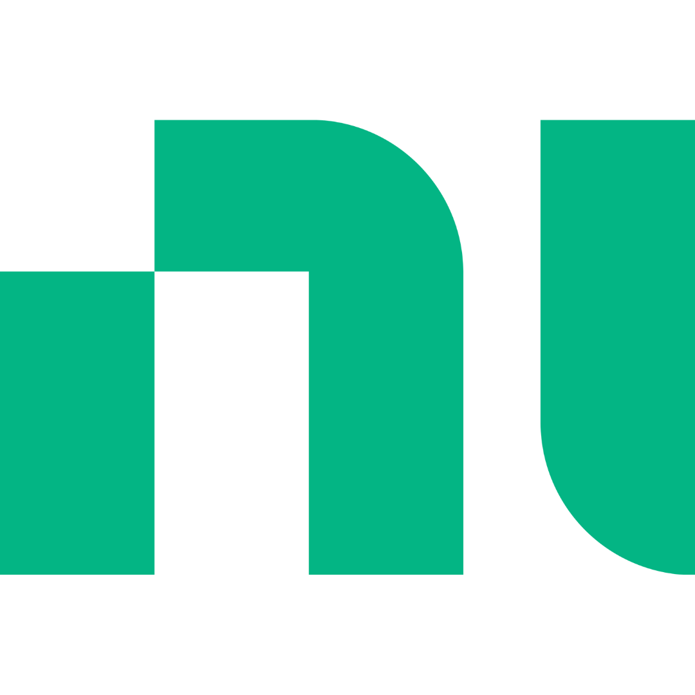

<!-- First Repository: ML | DL | CV Projects -->

<!-- Second Repository: Data Analytics Projects -->

  

# Portfolios

<table style="max-width: 100%; width: 100%;">
<tr>
<!-- First Action Button: ML | DL | CV Projects -->
<td align="center" width="50%">
 <a href="https://sri-dsa.github.io/ML/" target="_blank">
   
    
   
<strong>ML | DL | CV Portfolio </strong>

 </a>
</td>
<!-- Second Action Button: Data Analytics Projects -->
<td align="center" width="50%">
 <a href="https://sri-dsa.github.io/DA/" target="_blank">
   
    
   
<strong>Data Analytics Portfolio </strong>

 </a>
</td>
</tr>
</table>

# Education

<table>
  <thead>
    <tr>
      <th><b>Masters Degree</b></th>
      <th><b>Bachelors Degree</b></th>
    </tr>
  </thead>
  <tbody>
    <tr align="center" width="50%">
      <td><b>Data Science and Analytics</b></td>
      <td><b>Control Engineering and Instrumentation</b></td>
    </tr>
    <tr align="center" width="50%">
      <td>
        
      </td>
      <td>
        
      </td>
    </tr>
    <tr align="center" width="50%">
      <td>2022 - 2024</td>
      <td>2018 - 2022</td>
    </tr>
    <tr align="center" width="50%">
      <td><a href="https://en.wikipedia.org/wiki/University_of_Leeds" target="_blank">🇬🇧</a></td>
      <td><a href="https://en.wikipedia.org/wiki/National_Institute_of_Technology,_Tiruchirappalli" target="_blank">🇮🇳</a></td>
    </tr>
    <tr align="center" width="50%">
      <td><b>Click to View:</b> <a href="https://drive.google.com/file/d/1fE_g1QdDP_7UnnN3q2OolZ3yB51ArjFK/view?usp=sharing" target="_blank">📜 Degree Certificate</a></td>
      <td><b>Click to View:</b> <a href="https://drive.google.com/file/d/1WdcokM4yQRKNRQAXqa2_a1d_h_84f6JH/view?usp=sharing" target="_blank">📜 Degree Certificate</a></td>
    </tr>
  </tbody>
</table>

---
# Experience

<table style="width: 100%; table-layout: auto;">
  <thead>
    <tr align="center">
      <th style="padding: 8px;"><b>Role</b></th>
      <th style="padding: 8px;"><b>Company</b></th>
      <th style="padding: 8px;"><b>Office</b></th>
      <th style="padding: 8px;"><b>Duration</b></th>
      <th style="padding: 8px;"><b>Location</b></th>
      <th style="padding: 8px;"><b>View Certificate</b></th>
    </tr>
  </thead>
  <tbody>
    <tr align="center">
      <td style="padding: 8px;"><b><a href="https://drive.google.com/file/d/1esKd2_C1NLxE0BZ3BUBC6ARaLAEvZtlH/view?usp=sharing" target="_blank">Research Assistant</a></b></td>
      <td style="padding: 8px;">
        
          <b>NIT Trichy</b>
      </td>
      <td style="padding: 8px;"><a href="https://www.nitt.edu/home/academics/departments/ece/facilitiesnservices/research_laboratories/artificial_intelligence_research/" target="_blank">Department of ECE</a></td>
      <td style="padding: 8px;"><i>Oct 2021 - Aug 2022</i></td>
      <td style="padding: 8px;">Trichy, India</td>
      <td style="padding: 8px;"><a href="https://drive.google.com/file/d/1esKd2_C1NLxE0BZ3BUBC6ARaLAEvZtlH/view?usp=sharing" target="_blank">📜 Click here</a></td>
    </tr>
    <tr align="center">
     <td style="padding: 8px;"><b> <a href="https://drive.google.com/file/d/1a9kMKXkOX11XjgUR2iWJ-Fx203d-Q8FW/view?usp=sharing" target="_blank">Analytics Intern</a></b></td>
      <td style="padding: 8px;">
        
          <b>National Instruments</b>
      </td>
      <td style="padding: 8px;"><a href="https://education.ni.com/center-of-excellence" target="_blank">Centre of Excellence</a></td>
      <td style="padding: 8px;"><i>Jan 2021 - Jun 2021</i></td>
      <td style="padding: 8px;">Noida, India</td>
      <td style="padding: 8px;"><a href="https://drive.google.com/file/d/1a9kMKXkOX11XjgUR2iWJ-Fx203d-Q8FW/view?usp=sharing" target="_blank">📜 Click here</a></td>
    </tr>
    <tr align="center">
      <td style="padding: 8px;"><b><a href="https://drive.google.com/file/d/1neV-J7jXe2Klf0jRQO5-IIJIjJ6fqleW/view?usp=sharing" target="_blank">ML Engineer Intern</a></b></td>
      <td style="padding: 8px;">
        
          <b>Indian Servers</b>
      </td>
      <td style="padding: 8px;">Hybrid</td>
      <td style="padding: 8px;"><i>June 2019 - March 2020</i></td>
      <td style="padding: 8px;">Hyderabad, India</td>
      <td style="padding: 8px;"><a href="https://drive.google.com/file/d/1neV-J7jXe2Klf0jRQO5-IIJIjJ6fqleW/view?usp=sharing" target="_blank">📜 Click here</a></td>
    </tr>
  </tbody>
</table>

# Connect with me    

---

<!-- First Repository: ML | DL | CV Projects -->

<!-- Second Repository: Data Analytics Projects -->

  

<!-- GitHub stats -->

 

      
    
  

