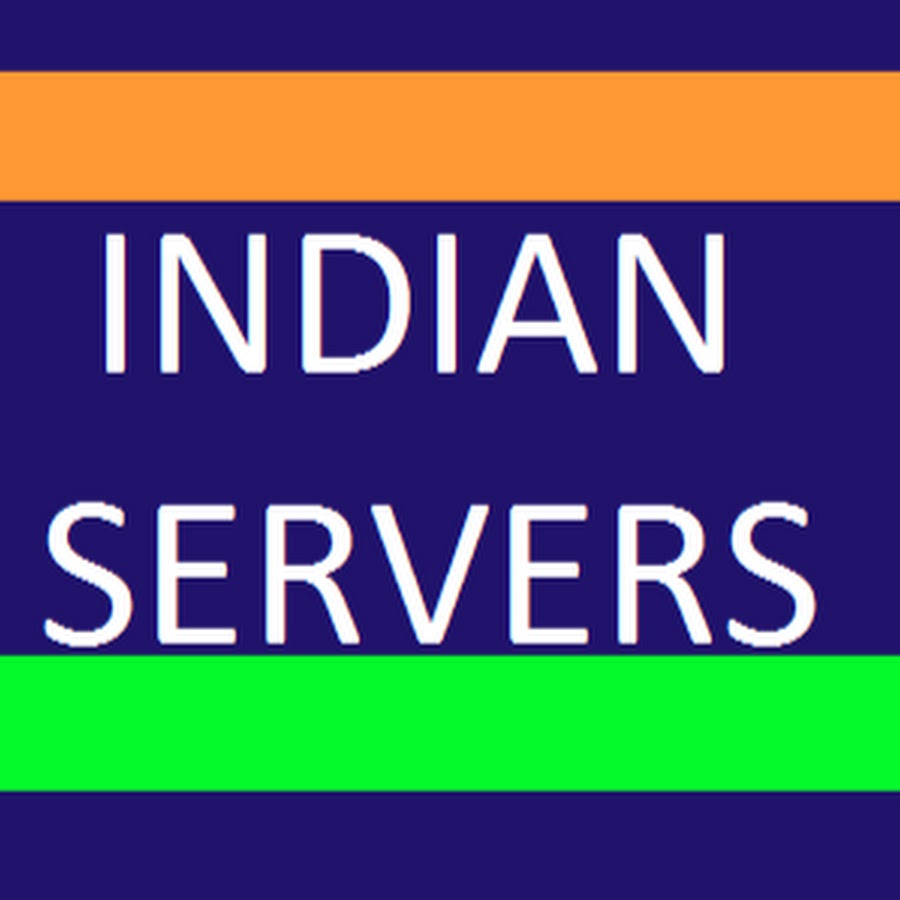

# Tech Stack

<table>
<tr>
<!-- First Action Button: ML | DL | CV Projects -->
<td align="center" width="50%">
 <a href="https://sri-dsa.github.io/ML/" target="_blank">
   
    
   
<strong>ML | DL | CV Projects </strong>

 </a>
</td>
<!-- Second Action Button: Data Analytics Projects -->
<td align="center" width="50%">
 <a href="https://sri-dsa.github.io/DA/" target="_blank">
   
    
   
<strong>Data Analytics Projects </strong>

 </a>
</td>
</tr>
</table>

# Education

| **Masters Degree**              | **Bachelors Degree**  |
|:-----------------------------:|:---------------------------------------:|
| **Data Science and Analytics**  | **Control Engineering and Instrumentation** |
|    |   |
| 2022 - 2024               | 2018 - 2022                        |
| [**🇬🇧**](https://en.wikipedia.org/wiki/University_of_Leeds) | [**🇮🇳**](https://en.wikipedia.org/wiki/National_Institute_of_Technology,_Tiruchirappalli) |
| **Click to View**: <a href="https://drive.google.com/file/d/1fE_g1QdDP_7UnnN3q2OolZ3yB51ArjFK/view?usp=sharing" target="_blank">📜 Degree Certificate </a> | **Click to View**: <a href="https://drive.google.com/file/d/1WdcokM4yQRKNRQAXqa2_a1d_h_84f6JH/view?usp=sharing" target="_blank"> 📜 Degree Certificate</a> |

---

## Experience

| **Role** | **Company** | **Office** | **Duration** | **Location** | **View Certificate** |
|:--:|:--:|:--:|:--:|:--:|:--:|
| **Research Assistant** |    **NIT Trichy** | <a href="https://www.nitt.edu/home/academics/departments/ece/facilitiesnservices/research_laboratories/artificial_intelligence_research/" target="_blank">Department of Electronics and Communication Engineering</a> | *October 2021 - August 2022* | Trichy, India | [📜 Click here](https://drive.google.com/file/d/1esKd2_C1NLxE0BZ3BUBC6ARaLAEvZtlH/view?usp=sharing) |
| **Analytics Intern** |    **National Instruments** |<a href="https://education.ni.com/center-of-excellence" target="_blank">Centre of Excellence</a>| *Jan 2021 - June 2021* | Noida, India | [📜  Click here](https://drive.google.com/file/d/1a9kMKXkOX11XjgUR2iWJ-Fx203d-Q8FW/view?usp=sharing) |
| **ML Engineer Intern** |    **Indian Servers** |Hybrid | *June 2019 - March 2020* | Hyderabad, India | [📜 Click here](https://drive.google.com/file/d/1neV-J7jXe2Klf0jRQO5-IIJIjJ6fqleW/view?usp=sharing) |

---

# Connect with me via:        

<!-- First Repository: ML | DL | CV Projects -->

<!-- Second Repository: Data Analytics Projects -->

<!-- GitHub Profile -->

  

<!-- GitHub stats and activity overview -->

 

