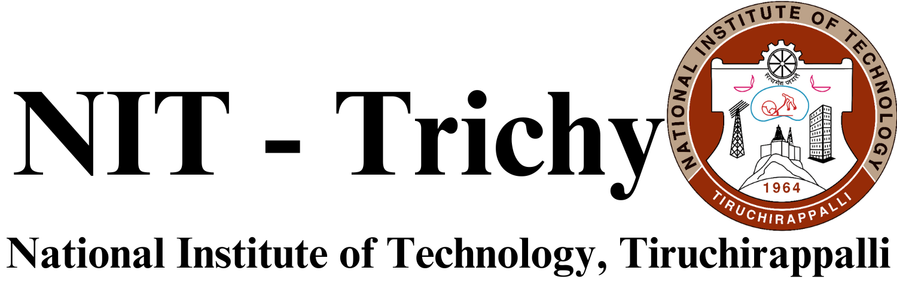

# 💻 Tech Stack

<table>
  <tr>
    <!-- First Action Button: ML | DL | CV Projects -->
    <td align="center" width="50%">
      <a href="https://github.com/sri-dsa/MachineLearningProjects" target="_blank">
        
         
        
<strong>ML | DL | CV Projects </strong>

      </a>
    </td>
    <!-- Second Action Button: Data Analytics Projects -->
    <td align="center" width="50%">
      <a href="https://github.com/sri-dsa/DataAnalyticsProjects" target="_blank">
        
         
        
<strong>Data Analytics Projects </strong>

      </a>
    </td>
  </tr>
</table>

# Education

| **Masters Degree**              | **Bachelors Degree**  |
|:-----------------------------:|:---------------------------------------:|
| **Data Science and Analytics**  | **Control Engineering and Instrumentation** |
|    |   |
| *2022 - 2024*               | *2018 - 2022*                        |
| [**🇬🇧**](https://en.wikipedia.org/wiki/University_of_Leeds) | [**🇮🇳**](https://en.wikipedia.org/wiki/National_Institute_of_Technology,_Tiruchirappalli) |
| **Click to View**: <a href="Leeds.pdf" target="_blank">Degree Certificate </a> | **Click to View**: <a href="Trichy.pdf" target="_blank">Degree Certificate</a> |

---

## **Experience**

| **Role** | **Company** | **Duration** | **Location** | **Proof** |
|:--:|:--:|:--:|:--:|:--:|
| **Research Assistant** |    **NIT Trichy** | *Oct 2021 - Aug 2022* | 🇮🇳 India | [📜 View Certificate](NITT_Experience.pdf) |
| **Analytics Intern** |    **National Instruments** | *May 2020 - Jan 2021* | 🇮🇳 India | [📜 View Certificate](NI_Experience.pdf) |
| **ML Engineer Intern** |    **Indian Servers** | *June 2019 - March 2020* | 🇮🇳 India | [📜 View Certificate](IS_Experience.pdf) |

---

# Contact
- **LinkedIn**: [Srivathsan Karthikeyan](https://www.linkedin.com/in/srivak/)  
- **HackerRank**: [sk_data](https://www.hackerrank.com/profile/sk_data)  
- **Email**: [sk.data@icloud.com](mailto:sk.data@icloud.com)

<!-- GitHub stats from https://github.com/anuraghazra/github-readme-stats -->
 
